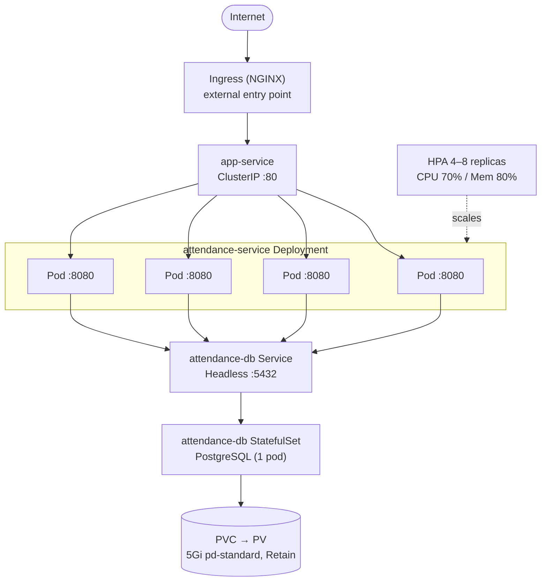
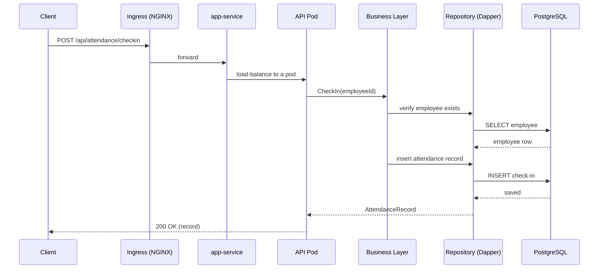
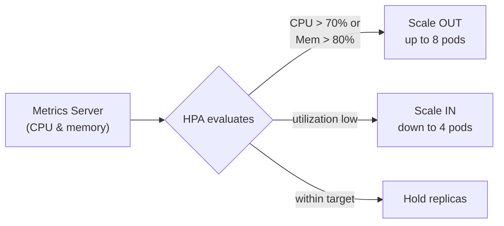

# Attendance Tracker — Solution Documentation

> A cloud-native Employee Attendance Tracking service built with .NET (ASP.NET Core), PostgreSQL, Docker, and Kubernetes (GKE).

---

## Table of Contents
1. [Requirement Understanding](#1-requirement-understanding)
2. [Assumptions](#2-assumptions)
3. [Solution Overview](#3-solution-overview)
4. [Justification for the Resources Utilized](#4-justification-for-the-resources-utilized)

---

## 1. Requirement Understanding

### 1.0 Understanding the Requirement

The requirement asks for a simple two-tier system: a microservice that exposes an API, and a database it talks to. The service is containerized, the image is pushed to Docker Hub, and everything runs on Kubernetes.

Here is how we read each part and what we built for it:

- **Two tiers, not one app.** The service and the database are kept separate so the service can scale and restart without affecting the data. We run the service as a stateless `Deployment` and the database as a `StatefulSet` with its own persistent storage. They are deployed and managed independently.

- **All data goes through the API.** Nothing talks to the database directly. The service exposes a REST API (`/api/...`) and is the only thing that reads from or writes to PostgreSQL. The database is reachable only inside the cluster.

- **One image, pushed to Docker Hub.** We build the service into a single Docker image using a multi-stage build (small final image) and push it to Docker Hub as `nnitheshreddy/attendance-tracker:v1`. Kubernetes pulls this image when it deploys.

- **Run on Kubernetes properly.** Beyond just running the pods, we added the pieces a real deployment needs: ConfigMap and Secret for config, Services and Ingress for networking, a PersistentVolume for storage, and an HPA for autoscaling.

### 1.1 Business Need
The system provides an **Employee Attendance Tracking** capability that allows an organization to:

- **Manage employees** — create, update, retrieve, and list employee records (employee code, name, email, department, designation, joining date).
- **Record attendance** — capture employee **check-in** and **check-out** events.
- **Query attendance** — retrieve attendance records by employee, by date, or across the whole organization.

### 1.2 Functional Requirements
| # | Requirement | Implemented By |
|---|-------------|----------------|
| FR-1 | Register and maintain employee master data | `EmployeeController` → `EmployeeService` → `EmployeeRepository` |
| FR-2 | Allow an employee to check in | `POST /api/attendance/checkin` |
| FR-3 | Allow an employee to check out | `POST /api/attendance/checkout` |
| FR-4 | Validate employee existence before attendance actions | Business-layer validation in `AttendanceController` |
| FR-5 | Retrieve attendance by employee / date / all | `GET /api/attendance/...` endpoints |
| FR-6 | Persist all data durably | PostgreSQL with a persistent volume |

### 1.3 Non-Functional Requirements
| Category | Requirement | How It Is Met |
|----------|-------------|---------------|
| **Scalability** | Handle variable load | Horizontal Pod Autoscaler (4–8 replicas) |
| **Availability** | No single point of failure for the app tier | 4 application replicas + rolling updates |
| **Durability** | Data must survive pod restarts | StatefulSet + PersistentVolume (`Retain` policy) |
| **Portability** | Run locally and in the cloud identically | Containerized with Docker; orchestrated by Kubernetes |
| **Observability** | Detect unhealthy pods | Readiness & liveness probes |
| **Security** | Keep credentials out of source | Kubernetes Secret for DB password |
| **Maintainability** | Clear separation of concerns | Service split into API / Business / DAL projects |

---

## 2. Assumptions

1. **One database instance is enough** for the expected load, so PostgreSQL runs as a single replica (no HA/replication).
2. **The service is stateless** — all data lives in PostgreSQL, so the API can scale to multiple pods.
3. **The cluster is GKE** — the StorageClass uses the GCE persistent disk driver (`pd.csi.storage.gke.io`).
4. **An NGINX Ingress Controller is available** (or will be installed) to expose the service.
5. **Metrics Server is available** so the HPA can read CPU/memory usage (enabled by default on GKE).
6. **The image is on Docker Hub** as `nnitheshreddy/attendance-tracker:v1`, and the cluster pulls it from there.
7. **No authentication** is added in this version — the API is open.
8. **The app and PostgreSQL share one password** from a single Secret key (`DB_PASSWORD` / `POSTGRES_PASSWORD`).
9. **Config comes from the environment** in Production (ConfigMap/Secret); local runs use the connection string in `appsettings`.
10. **Swagger UI** is used to test the API.

---

## 3. Solution Overview

### 3.1 Kubernetes Deployment Topology
The system runs as two tiers on Kubernetes. External traffic enters through the NGINX Ingress, reaches the stateless API pods via a ClusterIP Service, and the pods talk to PostgreSQL through a headless Service. PostgreSQL keeps its data on a persistent volume, and the HPA scales the API pods up or down based on load.

### 3.2 Request Lifecycle (Check-in)
This shows how a single request travels through the tiers. The client only ever talks to the API — the database is reached only from inside the service — which is exactly the API-mediated access the requirement asks for.

### 3.3 Autoscaling Behavior
The Horizontal Pod Autoscaler watches CPU and memory usage (via the Metrics Server) and adjusts the number of API pods between 4 and 8, so the service adds capacity under load and releases it when idle.

---

## 4. Justification for the Resources Utilized

### 4.1 Application Technology Choices
| Resource | Why It Was Chosen |
|----------|-------------------|
| **ASP.NET Core Web API** | Mature, high-performance, cross-platform framework; first-class container support; built-in DI and configuration. |
| **Dapper (micro-ORM)** | Lightweight and fast with direct SQL control; lower overhead than a full ORM for a focused data model, while still preventing SQL injection via parameterized queries. |
| **PostgreSQL** | Reliable, open-source relational database well-suited to structured employee/attendance data and transactional integrity. |
| **Layered structure (API/Business/DAL)** | Separation of concerns improves testability and maintainability, and lets each layer evolve independently. |
| **Swagger / OpenAPI** | Self-documenting API and an interactive test surface, used as the health-probe target as well. |

### 4.2 Kubernetes Resource Justifications
| Resource | Why It Is Needed |
|----------|------------------|
| **Namespace (`attendance`)** | Logical isolation, easier RBAC, quotas, and clean teardown of all resources together. |
| **Deployment (4 replicas, rolling update)** | The API is stateless, so a Deployment is the right controller; multiple replicas give availability and the rolling strategy gives zero-downtime releases. |
| **StatefulSet for PostgreSQL** | Databases need a **stable network identity** and **stable persistent storage**; a StatefulSet (vs. Deployment) guarantees both, with ordered, predictable pod identity (`attendance-db-0`). |
| **Headless Service (DB)** | `clusterIP: None` gives the StatefulSet pod a stable DNS name for direct, reliable connections from the app. |
| **ClusterIP Service (App)** | Provides a single stable internal endpoint that load-balances across the 4–8 app pods; not exposed externally by design. |
| **Ingress (NGINX)** | Single, controlled HTTP entry point; supports host/path routing and the root→Swagger redirect via annotations, avoiding per-service external load balancers. |
| **ConfigMap** | Externalizes non-sensitive configuration so the same image runs across environments without rebuilds. |
| **Secret** | Keeps the database password out of source control and image layers; injected at runtime as an environment variable. |
| **PersistentVolume via StorageClass** | Decouples data lifecycle from pod lifecycle so attendance data survives restarts/rescheduling. |
| **StorageClass (`Retain`, `pd-standard`)** | `Retain` protects data from accidental deletion when the PVC is removed; `pd-standard` is a cost-effective disk tier appropriate for this workload; `allowVolumeExpansion` permits future growth. |
| **HorizontalPodAutoscaler (4–8, 70% CPU / 80% mem)** | Automatically matches capacity to demand — scales out under load for performance, scales in when idle for cost efficiency. The minimum of 4 preserves baseline availability. |
| **Readiness/Liveness Probes** | Ensure traffic only reaches healthy pods and that stuck pods are restarted automatically, improving reliability. |

### 4.3 Sizing & Policy Rationale
| Setting | Value | Rationale |
|---------|-------|-----------|
| App `requests` / `limits` | 100m–300m CPU, 128Mi–256Mi mem | Small footprint allows dense scheduling while limits cap noisy-neighbor risk. |
| DB `requests` / `limits` | 200m–500m CPU, 256Mi–512Mi mem | Database gets more headroom than individual app pods as the stateful core. |
| HPA min replicas | 4 | Baseline availability across nodes even at low load. |
| HPA max replicas | 8 | Caps scale-out to control cost while handling spikes. |
| Storage size | 5Gi | Sufficient for current attendance dataset with room to grow (expandable). |
| Reclaim policy | `Retain` | Prevents irreversible data loss on PVC deletion. |

---

### Summary
The solution delivers a **scalable, resilient, and maintainable** attendance-tracking service. A clean layered .NET application is containerized with a multi-stage build and orchestrated on GKE using purpose-fit Kubernetes primitives: a **Deployment + HPA** for the elastic stateless API, a **StatefulSet + PersistentVolume** for durable data, **ConfigMaps/Secrets** for clean configuration management, and an **Ingress** for controlled external access — each resource chosen to satisfy a specific functional or non-functional requirement.
